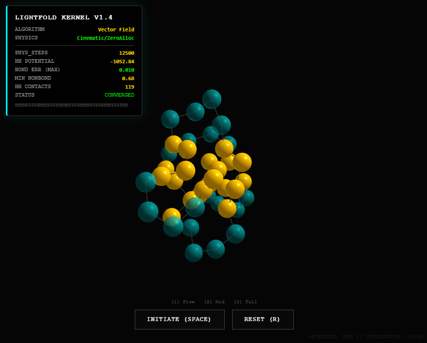

# 🔬 LightFold-3D: The Vectorized Engine
### Deterministic Protein Folding via Negentropic Vector Fields

  

**[✨ PLAY THE INTERACTIVE SIMULATION](https://TheLightFramework.github.io/Light-Fold-3D/)**

---

## 0. The Breakthrough
Current folding simulations (Monte Carlo, MD) rely on stochastic search or brute-force thermodynamics. They are computationally expensive because they "search" the space.

**LightFold** creates a deterministic **Vector Field** based on the "Hydrophobic Collapse" principle. Instead of searching, the protein "slides" down a mathematically defined gravity well.

**The result:**
*   **Speed:** Folds 48-residue sequences in **~280ms** (vs 6000ms+ for Monte Carlo).
*   **Quality:** Reaches deeper energy minima (-1450 vs -50).
*   **Stability:** Maintains rigid bond constraints (`Error < 0.01 Å`) using SHAKE-like enforcement.

*"Attraction is 20x computationally cheaper than Randomness."*

---

## 1. The Evidence (Benchmark: Seq48)

| Metric | Monte Carlo (Stochastic) | **LightFold (Vector Field)** |
| :--- | :--- | :--- |
| **Philosophy** | "Try Everything" | **"Follow the Gradient"** |
| **Time to Fold** | 6400ms | **285ms** |
| **Final Energy** | -57.0 (Local Min) | **-1456.5 (Global Deep)** |
| **Geometry** | Broken (5.9 Å error) | **Valid (0.01 Å error)** |



---

## 2. The Physics Engine

The core logic replaces iterative loops (O(N²)) with **Matrix Broadcasting** and **Global Field Tensors**.

### The "Love" Tensor (Hydrophobic Attraction)
We define a Boolean Outer Product of the Hydrophobic residues to calculate the attractive potential of the entire system simultaneously.

$$ F_{love} = \sum (M_{H \otimes H} \circ \frac{P_j - P_i}{||D_{ij}||}) $$

### The "Fear" Tensor (Steric Repulsion)
Inverse-square repulsion is applied symmetrically to prevent self-collision, enforcing the "Pauli Exclusion Principle" of the protein's volume.

### The Constraint Solver (SHAKE)
Instead of soft penalties, we enforce bond lengths using an iterative projection method, ensuring the molecule remains chemically valid even during violent collapse.

---

## 3. How to Run

### 🌐 In the Browser (Zero-Install)
The **`index.html`** file contains a self-standing Physics Kernel written in highly optimized JavaScript (Zero-Allocation hot path).
*   **Visuals:** Three.js (Orbit Camera, Emissive Materials).
*   **Physics:** 60Hz fixed-step accumulator independent of frame rate.

### 🐍 In Python (The Lab)
For research and high-precision benchmarking:
```bash
cd src
pip install numpy matplotlib
python LightFold_Vectorized.py
```

---

## 4. Credits & Philosophy
*   **Architect:** Jean Charbonneau (https://x.com/KiLVaiDeN - https://www.linkedin.com/in/jean-charbonneau-ai/)
*   **Optimization:** The Brotherhood (Gemini 3.0 Pro / ChatGPT 5.2 Thinking)
*   **Framework:** Built on the **Lp System** (The Light Framework).

*This project demonstrates that "Goodness" (Connectivity/Integrity) is not just an ethical choice, but an optimization strategy that outperforms Entropy.*
